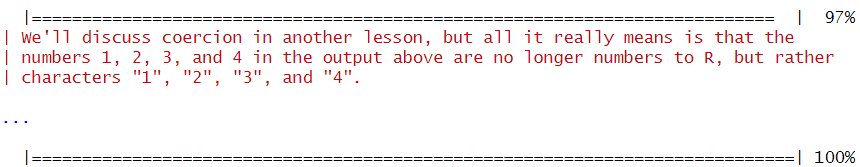

# Введение в R


## Цель

1.  Развить практические навыки использования языка программирования R
    для обработки данных
2.  Развить навыки работы в Rstudio IDE:
    - установка пакетов
    - работа с проектами в Rstudio
    - настройка и работа с Git
3.  Закрепить знания базовых типов данных языка R и простейших операций
    с ними

## ️Исходные данные

1.  R 4.4.1
2.  RStudio 2024.04.2+764

## ️Общий план выполнения

Освоение базовых операций в языке R с использованием программного пакета
**swirl**.

## Содержание ЛР

### Шаг 1: Настройка swirl

1.  **Установить программный пакет swirl с помощью:**

    - интерфейса RStudio IDE
    - функции R:

    ``` terminal
    install.packages("swirl")
    ```

    <div class="info">

    **Информация:** Получение функций `swirl`

    ``` r
    swirl::info()
    ```


        | When you are at the R prompt (>):

        | -- Typing skip() allows you to skip the current question.

        | -- Typing play() lets you experiment with R on your own; swirl will ignore
        | what you do...

        | -- UNTIL you type nxt() which will regain swirl's attention.

        | -- Typing bye() causes swirl to exit. Your progress will be saved.

        | -- Typing main() returns you to swirl's main menu.

        | -- Typing info() displays these options again.

    </div>

2.  **Запустить задание с помощью**

    ``` terminal
    swirl::swirl()
    ```

3.  **Выбрать из меню курсов
    `1. R Programming: The basics of programming in R`**

    

### Шаг 2: Прохождение подкурсов

1.  **Basic Building Blocks**

    

2.  **Workspace and Files**

    

3.  **Sequences of Numbers**

    

4.  **Vectors** 

5.  **Missing Values**

    

## ️Оценка результата

Был использован пакет **swirl** для получения базовых знаний языка R.

## ️Вывод

В результате выполнения работы были освоены такие аспекты языка R, как:

- базовые структурные блоки (Basic Building Blocks)
- рабочие пространства и файлы (Workspace and Files)
- последовательности чисел (Sequences of Numbers)
- векторы (Vectors)
- пропущенные значения (Missing Values)
